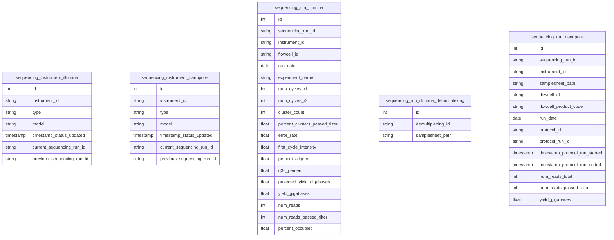

# Entity Relationship Diagrams

```mermaid
erDiagram
  sequencing_instrument_illumina {
    int id
    string instrument_id
    string type
    string model
    timestamp timestamp_status_updated
    string current_sequencing_run_id
    string previous_sequencing_run_id
  }
  
  sequencing_instrument_nanopore {
    int id
    string instrument_id
    string type
    string model
    timestamp timestamp_status_updated
    string current_sequencing_run_id
    string previous_sequencing_run_id
  }
  
  sequencing_run_illumina {
    int id
    string sequencing_run_id
    string instrument_id
    string flowcell_id
    date run_date
    string experiment_name
    int num_cycles_r1
    int num_cycles_r2
    int cluster_count
    float percent_clusters_passed_filter
    float error_rate
    float first_cycle_intensity
    float percent_aligned
    float q30_percent
    float projected_yield_gigabases
    float yield_gigabases
    int num_reads
    int num_reads_passed_filter
    float percent_occupied
  }
  
  sequencing_run_illumina_demultiplexing {
    int id
    string demultiplexing_id
    string samplesheet_path
  }
  
  sequencing_run_nanopore {
    int id
    string sequencing_run_id
    string instrument_id
    string samplesheet_path
    string flowcell_id
    string flowcell_product_code
    date run_date
    string protocol_id
    string protocol_run_id
    timestamp timestamp_protocol_run_started
    timestamp timestamp_protocol_run_ended
    int num_reads_total
    int num_reads_passed_filter
    float yield_gigabases
  }
```
